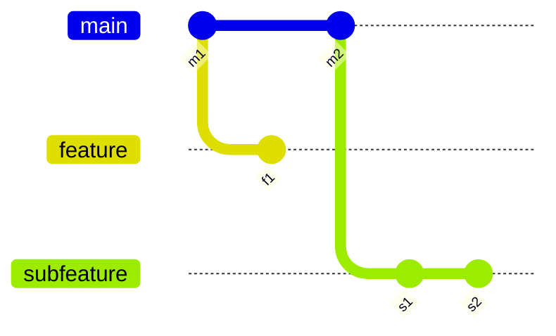

#review #brewing #computer_science #git

# Git Rebase Onto

A specific case of [[Git Rebase]]: `git rebase --onto <newbase> <upstream> [<branch>]` replays a *specific range* of commits onto a different base, instead of the plain `git rebase <newbase>`'s all-or-nothing move of everything since the branch point.

## Why the plain form isn't enough
Plain `git rebase master` replays every commit on the current branch that isn't already on `master` (see [[Git Rebase]] for the general mechanics). That's fine for a simple feature branch, but breaks down once branches stack on top of each other — you often want to move *only* a sub-range of commits, not everything back to the original branch point.

## The three arguments
- **`<newbase>`** — the commit the selected range gets replayed onto.
- **`<upstream>`** — the cutoff: commits reachable from `<upstream>` are excluded: only commits *after* it are replayed.
- **`<branch>`** *(optional)* — which branch's tip to take the commits from; defaults to whatever's currently checked out, and that branch is moved to point at the result.

## Worked example: dropping an intermediate branch
Three branches stacked on top of each other: `feature` was cut from `master`, then `subfeature` was cut from `feature`. `master` has since moved forward, and `subfeature` needs to carry only *its own* commits directly onto the new `master` — without also pulling in `feature`'s commits.



```
git rebase --onto master feature subfeature
```
Reads as: *take the commits in `subfeature` that aren't in `feature`* (i.e. `s1`, `s2` — `subfeature`'s own work), *and replay them starting from `master`*. `feature`'s commits (`f1`) are excluded entirely because `<upstream>` marks the cutoff. The result is `subfeature` rebuilt directly on current `master`, as if it had been branched from there all along.

## Other common uses
- **Dropping the earliest N commits of a branch** — `git rebase --onto HEAD~5 HEAD~3` moves the last 3 commits to sit directly on what used to be 5 commits back, discarding the 2 in between.
- **Moving a branch after squashing/discarding an upstream branch** that it was accidentally based on.

## Related
Part of [[Git Rebase]]. Further reading: [Git Branching — Rebasing](https://git-scm.com/book/be/v2/Git-Branching-Rebasing).

---
Part of [[Computers]] · related: [[Git]], [[Git Rebase]]
