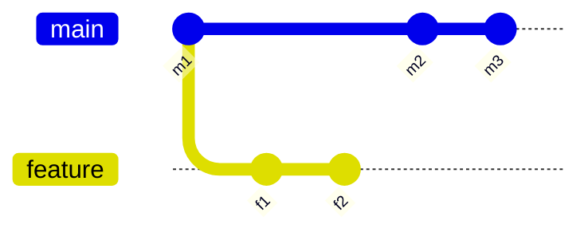

#review #brewing #computer_science #git

# Git Rebase

Replays a branch's commits one at a time onto a different base commit, producing a linear history instead of a merge commit — but every replayed commit gets a **new hash**, even if its content is identical, because its parent changed.

## Rebase vs. merge
- **Merge** creates a new commit joining two histories together. Preserves the true, parallel shape of what happened (a feature branch really did diverge and later rejoin), at the cost of a merge commit and a more tangled graph as branches multiply.
- **Rebase** rewrites the branch as if its commits had been made on top of the new base all along. Result: a clean, linear history with no merge commit — but the rewritten commits are not the same objects as before (same diff/message, different SHA, different parent).
- **The golden rule**: never rebase commits that other people have already pulled and built on top of. Since rebase creates new commit objects, publishing a rebased branch requires a force-push, and anyone who already has the old commits will diverge from you — their next pull either conflicts or silently duplicates work, and any of their own commits added on top of the old ones get orphaned unless they also rebase onto your new history.

## Mechanics: what actually happens
For `feature` sitting on top of `master`, running `git rebase master` while on `feature`:
1. Git finds the merge base — the common ancestor commit of `feature` and `master`.
2. It sets aside every commit unique to `feature` since that base, in order.
3. It moves `feature`'s starting point to `master`'s current tip.
4. It reapplies each set-aside commit, one at a time, as a brand-new commit on top.

After `git rebase master` on `feature`: `f1` and `f2` are replayed as new commits `f1'` and `f2'` directly on top of `m3` — `feature` now looks like it was branched from `m3`, not `m1`.

## Interactive rebase
`git rebase -i <base>` opens an editable list of the commits between `<base>` and your branch tip (oldest first), one action per line — a way to clean up local history before sharing it:
- **`pick`** — keep the commit as-is.
- **`reword`** — keep the changes, stop to edit the commit message.
- **`edit`** — pause at this commit so you can amend it (fold in a missed change, or split it into several).
- **`squash`** — merge this commit into the one above it, combining both commit messages for editing.
- **`fixup`** — merge into the commit above it, but silently discard this commit's message.
- **`drop`** — remove the commit entirely.
- Reordering the lines reorders the commits (as long as no later commit depends on a change from a commit you moved past it).

The common case: turning a string of `wip`, `fix typo`, `address review comment` commits into one clean commit before opening a merge request.

### `--autosquash` / `--autostash`
- Commit with `git commit --fixup=<sha>`, then `git rebase -i --autosquash <base>` — the interactive list is pre-arranged with that fixup commit already moved next to its target, so you don't hand-reorder it.
- `git rebase --autostash` — stashes uncommitted local changes before the rebase starts and reapplies them after, for when you forgot you had a dirty working tree.

## Conflicts during a rebase
Because commits are replayed one at a time, a conflict pauses the rebase at the *specific commit* that introduces it — not as one combined diff the way a merge conflict is. Resolve the files, `git add` them, then `git rebase --continue`. `git rebase --abort` restores the branch to exactly where it was before the rebase started. `git rebase --skip` drops the currently-conflicting commit and moves on.

Because the same contested lines can be touched by more than one commit in the replayed range, a rebase across a long-diverged branch can mean resolving what feels like "the same" conflict several times — once per commit that touches it. That repeated-resolution cost is a practical reason to keep branches short-lived, or to prefer a merge over a rebase once two branches have diverged a long way.

## When to use it
- **Use** — cleaning up local, unshared commits before opening a merge request; keeping a feature branch's diff linear and reviewable commit-by-commit; restructuring stacked branches with [[Git Rebase Onto]].
- **Avoid** — on any branch other people have already pulled and built on top of, unless the team has explicitly signed up for coordinated force-pushes. [[GitLab Merge Trains]] solves the adjacent "will this actually work once merged" problem for shared branches without needing history rewrites at all.

## Related
- [[Git Rebase Onto]] — the same replay mechanism, restricted to a specific commit range
- [[Git]] — the objects rebase creates and rewrites under the hood
- [[GitLab Merge Trains]] — a shared-branch safety mechanism that doesn't rely on rebasing

---
Part of [[Computers]] · related: [[Git]], [[Git Rebase Onto]]
