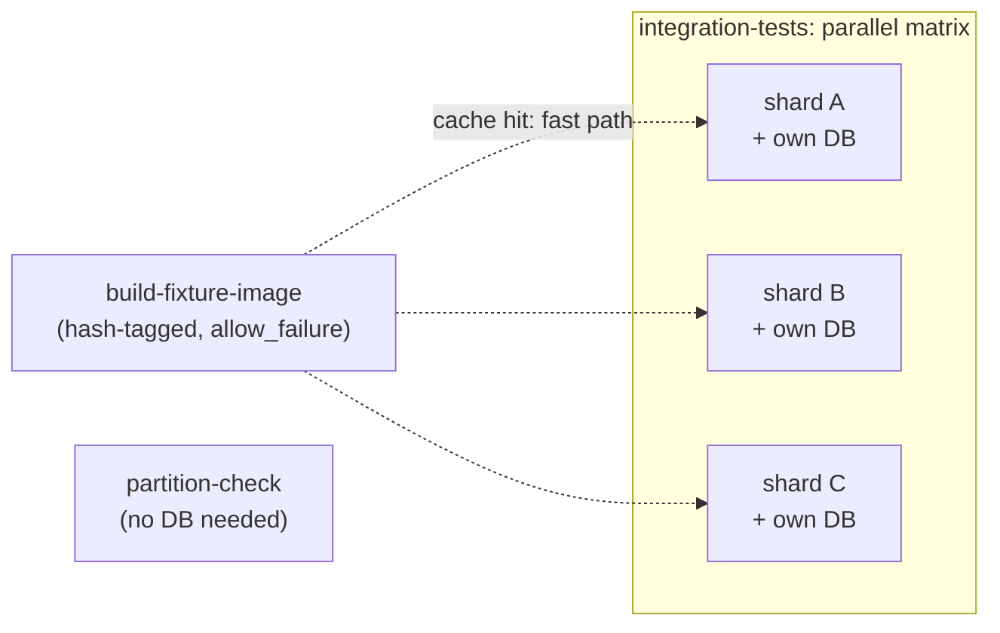

#review #brewing #computer_science #devops #cicd #testing

# GitLab CI - Integration Test Sharding

A single integration-test job that walks an entire suite serially becomes the long pole of a pipeline once the suite grows large enough — especially when each test needs a real dependency (a database, a message broker) rather than an in-memory fake. Sharding fixes the wall-clock by splitting the suite across parallel jobs; the interesting part is making that split *safe* and *fast*, not just parallel.

## The core mechanism
Each shard is one instance of a job fanned out with [[GitLab CI|`parallel: matrix`]], filtered to a disjoint slice of the suite (e.g. by fully-qualified test name prefix) and running against its **own** isolated instance of whatever the tests depend on. Wall-clock becomes "slowest shard," not "sum of every test" — the same win as any other embarrassingly-parallel fan-out, applied to tests specifically.

Shard filters must be **disjoint and complete**: every test in exactly one shard. Prefix filters need to be anchored (matched against a full namespace segment, not a bare substring) or one area's name can silently absorb tests from another.

## Enforcing the partition, not just defining it
Hand-maintained shard filters drift: a new test class can land in **no** shard (silently never runs again) or **two** shards (runs twice — wasted time, and a duplicate run can mask a flaky interaction rather than reveal it). The fix is a dedicated, fast CI job that:
1. Discovers every test in the suite (e.g. `dotnet test --list-tests`).
2. Applies each shard's **actual** filter expression — not a reimplementation of the filter grammar, so the check can never disagree with what the shards really execute.
3. Fails the build if the union of all shards isn't exactly the full set, or any test appears in more than one.

This job needs none of the real dependencies the tests themselves need (no database, no sandbox) — it only discovers and filters test *names* — so it stays cheap enough to run on every single pipeline, not just occasionally.

## Baking an expensive, shared test dependency
If every shard needs its own instance of something slow to prepare (schema migrations plus reference data for a database, say), re-preparing it identically in every shard burns back the exact time sharding was meant to save. Fix: bake a **content-hash-tagged image** of the prepared dependency once.
- Hash exactly the inputs that determine its content: schema/migration sources, seed scripts, any pinned dependency version that affects the generated schema, the base image version.
- Before rebuilding, check whether an image tagged with that hash already exists — a cache hit is a no-op.
- Every shard resolves and uses the same hash-tagged image when it's present.

## Why not bake the whole seed
If part of what gets seeded is **time-relative** (a row that's only "current" for a fixed window measured from when it was created), baking it into a long-lived image freezes that clock at bake time. The image silently drifts out of validity as it ages, and tests depending on that data start failing for reasons that have nothing to do with the code under test — a flaky-looking failure that's actually just "the fixture got old." The fix is splitting what's prepared into a **static part** (safe to bake once and reuse until its own inputs change — schema, structure) and a **dynamic part** (regenerated fresh on every single run — time-relative seed rows), baking only the former.

## Don't force shards to wait on the bake
The job that (re)builds the shared baked dependency is a pure optimization: a cache hit is instant, a cache miss makes it the slowest job in the pipeline. Wiring every shard to [[GitLab CI|`needs:`]] it would mean the *common* case (cache hit) pays no penalty, but the *rare* case (cache miss) now forces every shard to serialize behind one slow job — worse than not sharding at all for that one run. Instead, leave the bake job un-`needs:`-ed and `allow_failure: true`, and have each shard independently check for the cached artifact at runtime, falling back to preparing its own copy locally if the shared one isn't ready. Either path is correct; only the fast path is fast.

## Retry as scoped flake containment
Splitting a suite into shards, each running at the same internal concurrency as before but now over a smaller, more homogeneous slice, can *expose* latent test-isolation bugs that a more diluted, mixed-area concurrency was previously masking. A per-job [[GitLab CI|`retry:`]] means one flaky shard reruns on its own, cheaply, instead of failing the whole pipeline — a deliberate, temporary stopgap while the actual flaky test gets a real isolation fix (see [[xUnit Test Parallelism and Fixture Isolation]]), not a substitute for one.

## Finding the long pole
Once shard-level parallelism is in place, the pipeline's wall-clock is bounded by whichever single shard is slowest. Don't guess which test or class to optimize next — pull a machine-readable test-duration report (e.g. a TRX file) from a clean shard run and sum duration by test class. The class with the largest total is the actual bottleneck; see [[xUnit Test Parallelism and Fixture Isolation]] for what to do once you've found it.

## Diminishing returns and the structural floor
Past a point, a shard's wall-clock stops being dominated by any single slow test and instead reflects fixed per-job overhead — checkout, compile, environment provisioning — that every shard pays regardless of how few tests it runs. Once you're here, rebalancing shards or splitting more test classes doesn't move the number; the next lever is cutting that shared per-job setup cost itself (e.g. reusing a prebuilt artifact instead of recompiling per shard), not sharding harder.

## Validating a sharding/flakiness change before trusting it
A single green pipeline run doesn't prove a change removed flakiness — it might just not have hit the flaky path that one time. Run the pipeline several independent times on the *exact same* commit and aggregate pass/fail plus timing across all of them. Because [[GitLab CI|pushing to the same ref auto-cancels the previous pipeline]], getting independent runs means using several disposable refs at that one commit, not repeatedly re-triggering the same branch. A result like "10/10 gates green, one shard flaked 3/10 times but recovered on retry every time" is a meaningfully stronger claim than one lucky green run, and it tells you *which* shard is the actual residual risk.

## Related
- [[GitLab CI]] — the `parallel: matrix`, `retry:`, and `needs:` mechanics this builds on
- [[GitLab CI - .NET Pipelines]] — the broader .NET pipeline this fits into
- [[xUnit Test Parallelism and Fixture Isolation]] — what makes a single shard's slowest class fixable

---
Part of [[Computers]] · related: [[GitLab CI]], [[xUnit Test Parallelism and Fixture Isolation]]
