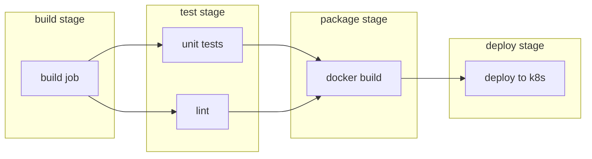

#review #brewing #computer_science #devops #cicd #gitlab

# GitLab CI

GitLab's built-in continuous integration/deployment system. Behavior for a repo is defined declaratively in a `.gitlab-ci.yml` file at the repo root; GitLab reads that file and schedules the work described in it whenever a pipeline is triggered.

## Core model: Pipeline → Stages → Jobs
- **Pipeline** — one full run of `.gitlab-ci.yml` for a given commit/ref. Triggered by a push, a merge request, a schedule, a tag, the API, or manually.
- **Stage** — a named, ordered phase (e.g. `build`, `test`, `package`, `deploy`). By default, stages run strictly in sequence — a stage only starts once every job in the previous stage has succeeded.
- **Job** — the actual unit of work: a script plus its environment (`image`, `tags`, `variables`, `cache`, `artifacts`, `rules`). Jobs within the same stage run in parallel by default, each in its own isolated environment.



## Runners
A **runner** is the agent that actually picks up and executes a job. GitLab (the server) only schedules; runners do the work.
- **Shared runners** — managed centrally, used by many projects; convenient but contended and generic.
- **Project/group runners** — dedicated to specific projects; more predictable performance, can be sized/tagged for specific workloads.
- **Executors** — how a runner runs a job: `docker` (spins up a fresh container per job — clean but no free incremental state), `shell` (runs directly on the runner's host — fast, but state can leak between jobs), `kubernetes` (runs each job as a pod).

Jobs are routed to runners via `tags:` — a job only runs on a runner advertising all the tags it requests, which is how you pin CPU-heavy jobs to beefier runners.

## Anatomy of `.gitlab-ci.yml`
- `stages:` — declares the ordered list of stage names used across the file.
- `image:` — default container image for jobs (can be overridden per job).
- `variables:` — pipeline/job-level env vars.
- `cache:` vs `artifacts:` — easy to confuse:
  - **cache** is a *best-effort* speed optimization (e.g. dependency folders) — it may or may not be there on the next run, and isn't guaranteed to be shared correctly across parallel jobs.
  - **artifacts** are *guaranteed* outputs of a job, passed forward to later stages/jobs and downloadable from the pipeline UI. Use `expire_in` so they don't accumulate storage forever.
	  - Both are subject to the same constraint: paths are always **relative to the project directory** — neither can point outside the checkout. A dependency cache that installs to somewhere outside the repo (e.g. a global package cache under the home directory) has to be redirected into a repo-relative folder via an env var, or `cache:` simply won't see it.
- `rules:` (modern) / `only:`/`except:` (legacy) — control whether a job runs for a given ref/pipeline source/change path.
- `needs:` — opts a job out of strict stage-sequencing and into a DAG: it only waits on the specific jobs it names, not the whole previous stage, so independent work can start earlier. `needs: - job: X artifacts: false` still waits on `X` for ordering but skips downloading its artifacts — useful when a job only cares that something finished, not what it produced.
- `include:` — pull in shared/templated pipeline config from other files, other projects, or published CI/CD **components**, which is how orgs standardize CI across many repos instead of copy-pasting YAML.

## Avoiding duplicate pipelines
Left unconfigured, a push to a branch with an open merge request triggers *two* pipelines at once: a branch pipeline and a merge-request pipeline running the same checks. The standard fix is a top-level `workflow: rules:` block:
```yaml
workflow:
  rules:
    - if: $CI_PIPELINE_SOURCE == "merge_request_event"
    - if: $CI_COMMIT_BRANCH && $CI_OPEN_MERGE_REQUESTS
      when: never
    - if: $CI_COMMIT_BRANCH
```
`workflow:` is evaluated once, before any job, to decide whether a pipeline runs at all — separate from `rules:` on individual jobs, which decide whether *that job* runs within a pipeline that's already going ahead.

## OIDC / ID tokens instead of static secrets
`id_tokens:` lets a job request a short-lived, signed JWT scoped to a chosen `aud:` (audience), instead of relying on a long-lived secret stored in CI/CD variables:
```yaml
job:
  id_tokens:
    VAULT_ID_TOKEN:
      aud: https://vault.example.org
  script:
    - curl -X POST https://vault.example.org/v1/auth/jwt/login --data "{\"jwt\": \"$VAULT_ID_TOKEN\"}"
```
The external service (a secrets manager, cloud IAM, a Kubernetes API) verifies the token's signature and claims (project, ref, expiry) before trusting it. Because the token expires in minutes and is minted fresh per job, there's no standing credential to leak or rotate.

## Reusable snippets: YAML anchors and `!reference`
Large pipelines end up needing the same `before_script` (start a service, fetch a token) in many jobs. Two ways to share it without copy-paste:
- **YAML anchors** (`&name` / `<<: *name`) — plain YAML aliasing.
- **`!reference [job-or-template, keyword]`** — GitLab-specific, lets a job's `before_script` include another block's `before_script` verbatim, and these compose (a template can `!reference` another template).

A leading-`.`-named job (e.g. `.default-setup:`) is never scheduled itself — it exists purely to be reused via `extends:`, an anchor, or `!reference`.

## Environments and deploy gates
`environment: name: ...` on a deploy job registers that deployment in GitLab's environment/deployment history (with rollback support). Combined with `rules:`/`when: manual` and `needs:`, this is how promotion pipelines are usually built: automatic deploys to lower environments on merge to the default branch, an explicit `when: manual` gate in front of production, and `needs:` naming the lower-environment deploy jobs so production can't even be triggered until they've succeeded. Non-blocking jobs (best-effort checks, docs publishing, exploratory analysis) use `allow_failure: true` so they report status without failing the pipeline.

## Fanning a job out: `parallel` and `parallel: matrix`
`parallel: N` runs N identical instances of one job concurrently (each can find its own slice via `$CI_NODE_INDEX`/`$CI_NODE_TOTAL`) — a blunt way to split an already-uniform workload N ways. `parallel: matrix` is more commonly useful: it defines one or more variables and creates one job instance per combination of their values:
```yaml
integration-tests:
  parallel:
    matrix:
      - SHARD: [creative, authz, campaign, featuremodules, advdata, rest]
  script:
    - export IT_TEST_FILTER="$(./shard-filter.sh "$SHARD")"
    - dotnet test --filter "$IT_TEST_FILTER"
```
This produces 6 independent job instances (`integration-tests: [creative]`, `integration-tests: [authz]`, …), each with `$SHARD` bound to a different value — the mechanism behind sharding a test suite (or any other partitionable workload) across parallel jobs, each with its own isolated environment. Listing more than one matrix variable produces the *cross product* of their values as separate instances. See [[GitLab CI - Integration Test Sharding]] for the design this enables end-to-end.

## `extends:` — GitLab-native job templates
`extends:` merges a job with one or more `.`-prefixed template jobs:
```yaml
.base-job:
  tags: [docker]
  before_script: [...]

my-job:
  extends: .base-job
  script: [...]
```
Unlike YAML anchors (a generic YAML parser feature) or `!reference` (which splices in one specific keyword's value), `extends:` deep-merges the *entire* job definition — the child's keys override the parent's, and anything the child doesn't specify is inherited wholesale. It's the more idiomatic choice for "this job is basically that job plus a few overrides"; reach for anchors/`!reference` instead when you only want to reuse one specific block without inheriting everything else about the template job.

## `retry:` — rerunning a failed job in place
`retry:` reruns one job (or one matrix instance) automatically on failure, without re-running the rest of the pipeline:
```yaml
integration-tests:
  retry:
    max: 2
    when:
      - script_failure
      - runner_system_failure
      - stuck_or_timeout_failure
```
Scoping `when:` to specific failure reasons is coarser than "retry only known-flaky tests" — a genuine test assertion failure and a flaky one both bucket under `script_failure` from GitLab's point of view — so this is a blunt containment tool, best paired with actually fixing the underlying flakiness rather than relied on indefinitely. It's a different tool from `allow_failure: true`: `retry:` says "try again, this probably works"; `allow_failure:` says "it's fine if this never works."

## Redundant pipelines auto-cancel by default
Pushing again to the same ref while a pipeline is still running cancels the now-outdated earlier pipeline automatically — usually desirable, since there's no point finishing a build for a commit that's already been superseded. Per-job `interruptible: true`/`false` controls whether *that specific job* is safe to kill mid-run this way (a deploy job is usually marked non-interruptible so a duplicate push can't cut it off partway). The practical consequence: you can't get N independent timing/flakiness runs on the *same* ref by pushing or retriggering N times — the Nth run cancels the (N-1)th. Genuinely independent runs need N different refs at the same commit (e.g. disposable throwaway branches), since separate refs can't cancel each other.

## `needs:` can be a deliberate *non*-dependency
The default instinct is to add `needs:` wherever one job's output feeds another — but it's equally valid to *not* add that edge for an optional, cacheable optimization step. Example: a job that bakes and pushes a cache-warming artifact (a pre-built test fixture, a pre-compiled asset) can be left with no downstream job `needs:`-ing it, specifically so consumers don't serialize behind it when it's slow (a cache miss) — they instead check for the cached artifact themselves at runtime and fall back to preparing it locally if it isn't there yet. Wiring `needs:` here would force every consumer to wait out the *worst* case (a full cache-miss bake) even on the common case (a cache hit that made the wait pointless). This is usually paired with `allow_failure: true` on the optimization job, so its own failure doesn't fail the pipeline either — consumers just fall back.

## Related
See [[GitLab CI - .NET Pipelines]] for how this maps onto .NET builds specifically, [[GitLab CI - Integration Test Sharding]] for the fan-out/matrix/retry mechanics applied to a real test suite, and [[Kubernetes]] for a common deploy-stage target.

---
Part of [[Computers]] · related: [[Git]], [[Kubernetes]], [[GitLab CI - Integration Test Sharding]]
