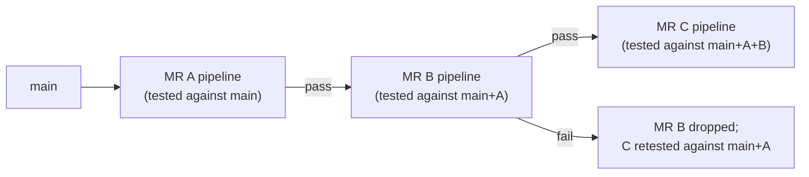

#review #brewing #computer_science #devops #cicd #gitlab #git

# GitLab Merge Trains

A queueing mechanism for merging multiple merge requests into a busy, protected branch (e.g. `main`) without any of them landing on top of a version of the branch their pipeline never actually tested.

## The problem it solves
Two MRs can each pass their own pipeline individually — tested against the *current* `main` — and still break `main` once both are merged, because neither pipeline ever ran against the combination of the two changes together. Merging one at a time and re-running CI serially avoids this but doesn't scale once a branch has enough merge traffic that the queue itself becomes the bottleneck.

## How it works
When a batch of MRs is queued to merge into a branch with merge trains enabled:
1. Each MR is added to an ordered train.
2. GitLab runs each MR's pipeline against a *predicted* future state of the target branch — as if every MR ahead of it in the train had already merged — not against the branch's current tip.
3. If an MR's train pipeline passes, it merges; the next MR in the train is then tested against the (now real) result.
4. If an MR's train pipeline fails, it's removed from the train, and the MRs behind it are automatically re-tested against the corrected predicted state — so one bad change doesn't silently poison the ones queued behind it.



## Trade-offs
- Requires "pipelines for merged results" (testing a hypothetical merge commit) rather than pipelines that only ever run against the MR's own branch.
- Adds latency per MR (each train position waits on the ones ahead), which matters more as train length grows — this is a throughput/latency trade against never breaking the target branch, not a free win.
- Most valuable on branches with high merge frequency and strict "never break main" requirements; low-traffic branches don't need the added queueing complexity.

## Job rules aware of train pipelines
A merge train produces its own pipeline type, distinguishable in a job's `rules:` via `$CI_MERGE_REQUEST_EVENT_TYPE == "merge_train"` — useful when a job needs to explicitly opt in to (or out of) running during a train pipeline specifically, rather than every ordinary MR pipeline:
```yaml
rules:
  - if: '$CI_MERGE_REQUEST_EVENT_TYPE == "merge_train"'
    when: always
  - when: always
```
Both branches resolving to `when: always` looks redundant, but it's a common scaffold: it names the train-pipeline case explicitly so a *narrower* rule can be dropped in for just that case later, without restructuring the whole block.

## Related
Builds on the stage/job model in [[GitLab CI]]; addresses the same "changes look fine alone" class of problem that `needs:`-based DAGs address for pipeline *ordering* rather than merge *safety*.

---
Part of [[Computers]] · related: [[GitLab CI]], [[Git]]
