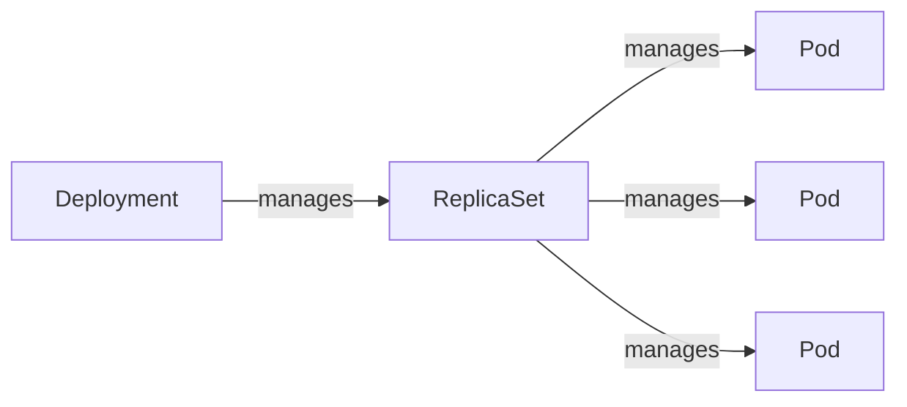

#review #brewing #computer_science #kubernetes

# Kubernetes Deployments

A **Deployment** is a controller object describing the desired state for a set of identical Pods — you describe "I want 3 replicas of this container image," and Kubernetes drives reality toward that continuously. You rarely touch the layers underneath directly: a Deployment manages a **ReplicaSet**, which manages the **Pods**.


Updating a Deployment (new image, new config) creates a *new* ReplicaSet and scales it up while scaling the old one down — that's what makes a rollout resumable and revertible: the old ReplicaSet sticks around (scaled to 0) until pruned, so rolling back is just re-scaling it back up.

## Rolling updates
`strategy.type: RollingUpdate` replaces Pods gradually rather than all at once, controlled by two knobs:
- **`maxSurge`** — how many *extra* Pods beyond the desired count are allowed during the rollout.
- **`maxUnavailable`** — how many of the desired count are allowed to be missing at once.

`maxSurge: 1, maxUnavailable: 0` is a common combination for anything latency-sensitive: it creates one new Pod *before* removing an old one, so capacity never dips below the desired replica count during a deploy — at the cost of briefly running one more Pod than the steady-state count.

`progressDeadlineSeconds` bounds how long a rollout is allowed to make no progress before Kubernetes marks it failed (visible via `kubectl rollout status`). It doesn't auto-rollback by itself — it's a signal that something (a crash-looping new Pod, a stuck probe) is blocking the rollout, not a safety net.

## Resource requests vs. limits
- **`requests`** — what the scheduler reserves when deciding which node a Pod fits on; this is a guarantee, not a cap.
- **`limits`** — the hard ceiling. Exceeding a CPU limit gets you throttled (slower, not killed); exceeding a memory limit gets the container OOMKilled.

Setting `requests` and `limits` to the *same* value for memory (but a higher `limits` than `requests` for CPU) is a common pattern: it avoids memory surprises — the Pod is scheduled assuming it needs exactly what it's capped at — while still letting CPU burst above the reserved baseline when there's slack on the node.

## PodDisruptionBudget (PDB)
A PDB caps how many Pods of a set can be down *at once* during **voluntary** disruptions — node drains, cluster upgrades, manual evictions — typically expressed as `maxUnavailable: 1`. It does not protect against involuntary disruption (a node crashing) or against the Deployment's own rollout logic, which is governed by `maxUnavailable`/`maxSurge` above instead.

## HorizontalPodAutoscaler (HPA)
Scales replica count based on an observed metric (commonly CPU utilization) against a target, bounded by `minReplicas`/`maxReplicas`. Setting `minReplicas` and `maxReplicas` to the *same* value effectively pins the replica count — sometimes done deliberately, to keep the object present (and its target metric visible) as a documented capacity baseline that can be turned into real autoscaling later just by widening the range.

## Kustomize: base + overlays instead of one templated YAML
[Kustomize](https://kustomize.io/) composes manifests by layering **patches** on top of a shared **base**, rather than templating a single YAML with variables:
```
Applications/<app>/
├── base/          # the "real" Deployment/Service/PDB, identical in shape across environments
└── overlays/
    ├── Development/   # patches: replica count, dev secrets, self-signed cert
    ├── Internal/      # patches: gateway config, internal-only secrets
    └── Production/    # patches: HPA, production secrets
```
A **Component** is a reusable patch fragment (e.g. "add these three secret-backed env vars to whatever Deployment includes me") that multiple apps' overlays can pull in without duplicating the same YAML in every app — the same idea as a shared library, applied to config.

## Related
- [[Kubernetes Probes]] — liveness/readiness gate what counts as "available" during a rollout
- [[Kubernetes - .NET Workloads]] — how these knobs map onto an ASP.NET Core container specifically
- [[Kubernetes]] — cluster/control-plane fundamentals this builds on

---
Part of [[Computers]] · related: [[Kubernetes]], [[Kubernetes Probes]]
