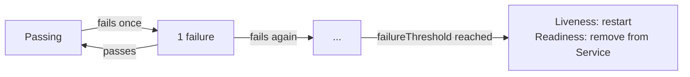

#review #brewing #computer_science #kubernetes

# Kubernetes Probes

Three distinct health checks a kubelet runs against a container — distinct because each **failure triggers a different action**, which is the thing to design around rather than treating "probe" as one generic concept.

| Probe | Question it answers | On failure |
|---|---|---|
| **Liveness** | Is this process stuck/deadlocked? | Kubelet **kills and restarts** the container |
| **Readiness** | Can this Pod serve traffic *right now*? | Pod is **pulled from the Service's endpoints** (no restart) |
| **Startup** | Has this (slow-starting) process finished initializing? | Liveness/readiness checks are **held off** until it passes |

## Why the distinction matters
A restart is disruptive and does nothing to fix an external problem — if the real issue is a downstream dependency being briefly unavailable, restarting the process doesn't help and just adds churn. Pulling a Pod out of rotation is cheap and instantly reversible. That asymmetry is the whole reason two separate probes exist:
- **Keep liveness shallow** — "is the process responding at all" — no external calls. A false failure here costs a real restart.
- **Put dependency checks (database, cache, downstream service reachability) behind readiness only** — a false failure here just means traffic briefly stops routing to this one Pod, which is the correct, low-cost response to "something upstream of me is having a bad time."

**The common anti-pattern**: wiring both liveness *and* readiness to the same endpoint that also checks downstream dependencies. A brief database blip then fails both at once — the Pod is (correctly) pulled from rotation *and* (incorrectly) restarted. If the dependency is down cluster-wide, every replica can restart in a cluster-wide wave for a problem restarting will never fix — potentially tipping into `CrashLoopBackOff` and a reconnect thundering-herd the moment the dependency does recover.

## Startup probes
For processes with a slow, one-time init phase (large cache warmup, schema migrations, JIT warmup), a startup probe absorbs that delay instead of forcing it onto the liveness probe's `initialDelaySeconds`/`failureThreshold` — settings that would otherwise also apply during steady-state operation, making a genuine post-startup hang take just as long to detect as first boot did. While the startup probe hasn't succeeded, liveness and readiness are not evaluated at all.

## Field reference and the restart-timing math
- **`initialDelaySeconds`** — grace period before the *first* check.
- **`periodSeconds`** — interval between checks.
- **`timeoutSeconds`** — how long a single check attempt gets before it counts as a failure.
- **`failureThreshold`** — consecutive failures before the probe's action fires.
- **`successThreshold`** — consecutive passes needed to flip back to healthy (must be `1` for liveness and startup).

Rough tolerance before a liveness restart fires: `periodSeconds × failureThreshold`. A liveness probe with `periodSeconds: 60, failureThreshold: 5` tolerates roughly five minutes of failed checks before restarting — deliberately generous, so a GC pause or a momentary hiccup doesn't cost a restart. Readiness is usually configured with a shorter fuse on the *same* schedule, since pulling a Pod from rotation is cheap enough to do eagerly.

## A quiet TLS detail
A kubelet's `httpGet` probe does not validate the TLS certificate chain, so an `httpGet` probe with `scheme: HTTPS` against a self-signed or internal certificate works with zero extra configuration — probes are one of the few callers that can hit an app's HTTPS port directly without a trusted CA behind it.

## Interaction with rollouts
A [[Kubernetes Deployments|rolling update]]'s `maxSurge`/`maxUnavailable` accounting is driven by **readiness**, not liveness — a Pod that's alive but not yet ready doesn't count toward available capacity, which is exactly what lets a rollout wait for a new Pod to actually be ready before removing an old one.

## Related
- [[Kubernetes Deployments]] — rollout mechanics that consume readiness state
- [[Kubernetes - .NET Workloads]] — where the anti-pattern above shows up almost by default in ASP.NET Core

---
Part of [[Computers]] · related: [[Kubernetes]], [[Kubernetes Deployments]]
