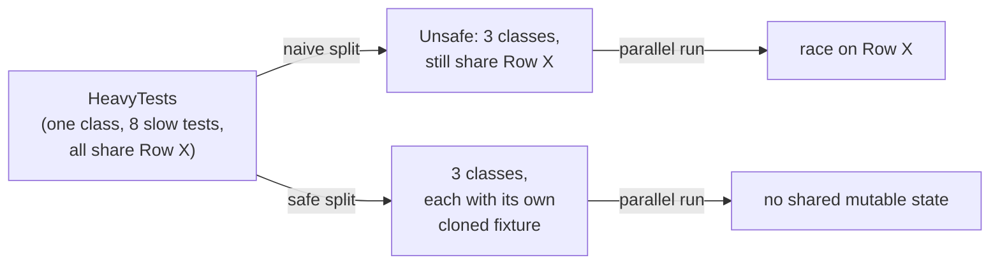

#review #brewing #computer_science #dotnet #testing

# xUnit Test Parallelism and Fixture Isolation

xUnit's default execution model: test **classes** run in parallel with each other (up to a configurable thread ceiling), but test **methods within the same class run serially**. A single class packed with slow tests is therefore a hard floor on how fast a run can go, no matter how much parallelism is available elsewhere — you cannot shard or filter your way around it at the method level.

## Why you can't just filter at the method level
Most test filter grammars only support substring or exact-name matching. Substring filters can't cleanly select "half the methods of this class," and exact-name filters miss parameterized `[Theory]` cases, whose generated names include their arguments. Splitting only works cleanly at the **class** level.

## The real fix: split into fixture-independent siblings
Move the offending class's tests into several sibling classes — commonly over a shared abstract base to keep setup/teardown/helpers DRY. Each sibling can now run in parallel with the others, since xUnit's serial guarantee only applies *within* one class, not across them.

## The safety condition
Splitting is only safe once each resulting class no longer shares **mutable** state with the others. If several tests mutate the same shared row/object (multiple tests updating one seeded record, say), splitting them into classes that now run concurrently turns a previously-safe serial sequence into a race: whichever test happens to run "second" may see the first test's midway state instead of the clean seed state, producing intermittent, hard-to-reproduce failures. A naive split that misses this is a real, common failure mode — not a hypothetical one — and typically surfaces as a revert once the race is discovered in practice.

**The safe recipe**: give each new sibling class its own dedicated fixture — e.g. clone the shared seed row/entity so each class mutates a copy nobody else touches, keeping it under the same parent/owner context so unrelated setup (auth, permissions) doesn't also have to change — *then* split. Tests that must legitimately share a fixture (one re-reads state a sibling test wrote) stay together in the same class instead of being split apart.

## `[Collection]` — the inverse tool
Where splitting solves "these tests can be independent, so let them run in parallel," `[Collection]` solves the opposite: forcing multiple *classes* to run serially with each other because they share a fixture or external resource that genuinely isn't safe for concurrent access. Reach for it when the honest fix isn't "give this its own fixture" but "this really must not run concurrently with that."

## Tuning the concurrency ceiling
The max number of test classes running concurrently is configurable (e.g. `xunit.runner.json`'s `maxParallelThreads`, plus any equivalent limit the test harness itself imposes on top). Lowering it is a short-term dial worth reaching for the moment a previously-undiscovered isolation bug surfaces in production-of-CI — trading speed for fewer intra-suite races — not a permanent substitute for the actual isolation fix.

## Where to look for the bottleneck
See [[GitLab CI - Integration Test Sharding]]'s "finding the long pole": sum a test-duration report by class; the class with the largest total is the split candidate. A class whose total is already close to `(sum of its tests' durations) / maxParallelThreads` is **setup-bound, not test-bound** — splitting it further won't help, because the fixed cost of provisioning the test environment (not the tests themselves) is the actual limit at that point.

## Related
- [[GitLab CI - Integration Test Sharding]] — the CI-level sharding this test-design technique makes worthwhile
- [[GitLab CI - .NET Pipelines]] — the broader .NET pipeline context

---
Part of [[Computers]] · related: [[GitLab CI - Integration Test Sharding]], [[GitLab CI - .NET Pipelines]]
