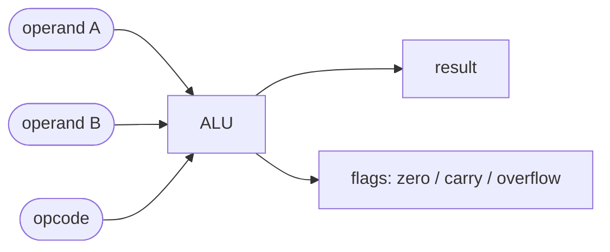

#review #brewing #digital #fundamentals #computer_science #cpu

# ALU (Arithmetic Logic Unit)

The **calculator** inside the [[CPU]]. Pure [[Combinational Logic]]: give it two numbers and an operation code, and it produces a result.

## What it does
- **Arithmetic** — add, subtract (built on the [[Adder]]), sometimes multiply.
- **Logic** — bitwise AND, OR, XOR, NOT (arrays of [[Logic Gates]]).
- **Shifts** — move bits left/right.
- **Flags** — side outputs like *zero*, *carry*, *negative*, *overflow*. These let the CPU make decisions (branches/if-statements).

## How the operation is chosen
An **opcode** feeds a [[Combinational Logic|multiplexer]] that selects which internal result to output. So the ALU actually computes *all* operations in parallel and just picks the one you asked for.

The ALU is where the silicon finally "does the math" a program asks for. It gets its inputs from registers/[[Memory]], and the [[Datapath and Control Unit]] decides what to feed it and where the answer goes.

---
Part of [[Electrons to CPU]].
