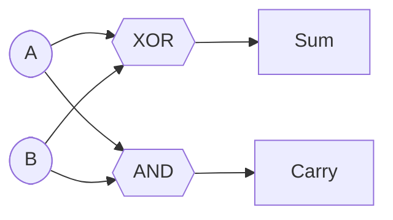
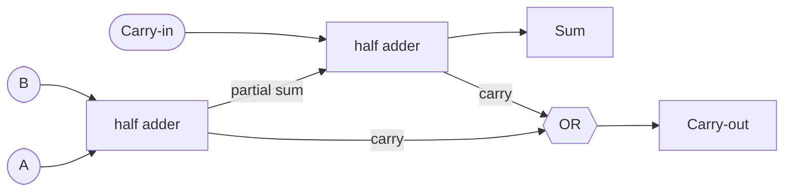

#review #brewing #digital #fundamentals #computer_science

# Adder

The concrete proof that [[Logic Gates|gates]] can do **arithmetic**. It's the workhorse inside every [[ALU]].

## Half adder
Adds two bits, A and B, producing a **sum** and a **carry**:
- Sum = `A XOR B`
- Carry = `A AND B`

That's it — addition is just two gates. (`1 + 1 = 10₂`: sum bit 0, carry 1.)

## Full adder
To add multi-bit numbers you must also accept a **carry-in** from the previous column. A full adder takes A, B, Cin → Sum, Cout, built from two half adders + an OR.

## Ripple-carry adder
Chain n full adders, feeding each carry-out into the next carry-in, and you add two n-bit [[Binary and Bits|binary]] numbers. Subtraction, comparison, and address math all reuse this same block.

This is the moment where "flipping switches" visibly becomes "doing math". Everything the [[ALU]] does is built up from adders and other [[Combinational Logic]].

---
Part of [[Electrons to CPU]].
