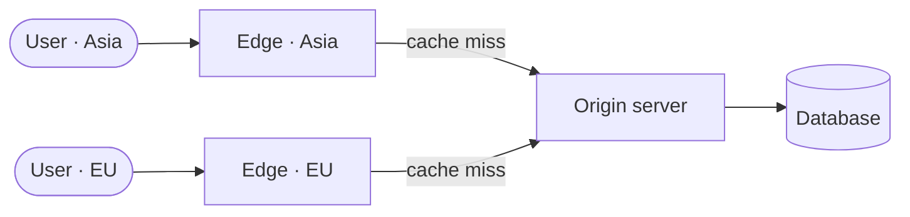

#review #brewing #computer_science #networking

# CDN (Content Delivery Network)

A geographically distributed set of caching servers ("edge" servers) that store copies of static content close to users. One of the caching layers listed in [[Caching]].

## Why it helps
- **Latency** — serve from an edge node physically near the user instead of the origin server across the world. Fewer network hops (see [[How does the internet work]]).
- **Offload** — absorbs read traffic so the origin server and its database aren't hammered; complements a [[LoadBalancer]] in front of the origin.
- **Availability** — content stays served even if the origin is briefly down.

## Two delivery models
- **Pull CDN** — the edge fetches content from the origin the first time it's requested, then caches it (with a TTL). Simplest; good for evenly-popular content.
- **Push CDN** — you upload content to the CDN ahead of time. Better control, good for large files with predictable demand.

## The catch
Same as any cache (see [[Caching]] limitations): **invalidation**. Stale edge copies must expire (TTL) or be purged when the origin changes. Best for content that changes rarely — images, JS/CSS, video.

---
Part of [[Computers]] · related: [[Caching]], [[CacheAccessPatterns]].
