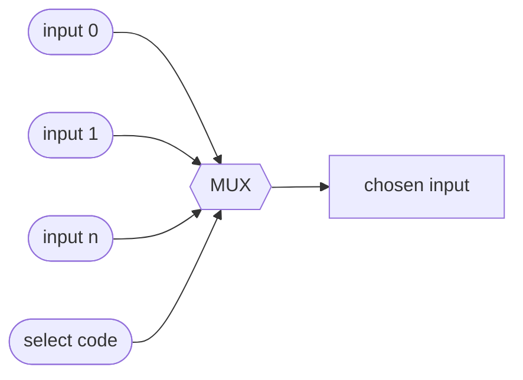

#review #brewing #digital #fundamentals #computer_science

# Combinational Logic

Circuits built from [[Logic Gates]] where **the output depends only on the current inputs** — no memory of the past. Feed in inputs, gates settle, out comes the answer.

## Common building blocks
- **[[Adder]]** — adds binary numbers (the heart of the [[ALU]]).
- **Multiplexer (mux)** — a selector: given N data inputs and a "select" code, passes one input through. This is how a [[CPU]] chooses *which* value to route where.
- **Decoder** — turns an n-bit code into "activate line number X" (e.g. picking one row of [[Memory]]).
- **Comparator** — outputs whether A = B, A > B, etc.

## The limitation that forces the next step
Combinational logic can *compute* anything as a function of its inputs, but it can't *remember*. The instant inputs change, the output changes. A computer needs to hold state — store a result, count, step through instructions. For that we need feedback and a clock → [[Sequential Logic]].

---
Part of [[Electrons to CPU]].
