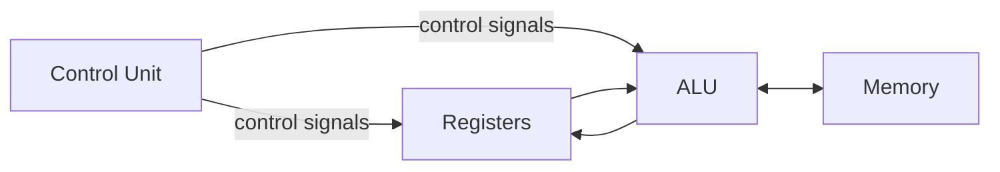

#review #brewing #digital #fundamentals #computer_science #cpu

# Datapath and Control Unit

The two halves that turn an [[ALU]] + [[Memory]] + registers into an actual [[CPU]].

## Datapath — the "roads"
The network of registers, the [[ALU]], and the wires/[[Combinational Logic|muxes]] connecting them. It's where data physically flows: from a register, through the ALU, back to a register or memory. Registers ([[Sequential Logic|flip-flops]]) hold the operands and results.

## Control Unit — the "traffic lights"
[[Sequential Logic]] that, each [[Clock Signal|clock cycle]], sets every control line in the datapath: which register to read, which [[ALU]] operation to run, whether to write [[Memory]], what to do next. It reads the current instruction and decodes it into these signals.

## Together
- **Control unit decides** *what* happens this cycle.
- **Datapath does** it.

Repeat every clock tick and you get the [[Instruction Cycle]] — the loop that executes a program. This is the top of the hardware stack; above it sits machine code, then languages.

---
Part of [[Electrons to CPU]].
