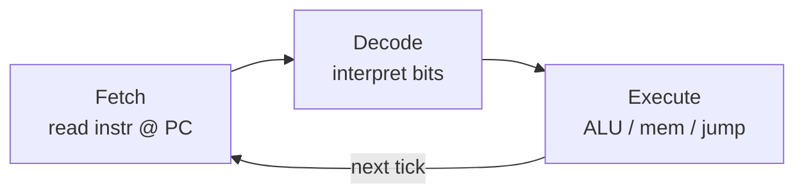

#review #brewing #digital #fundamentals #computer_science #cpu

# Instruction Cycle (Fetch–Decode–Execute)

The loop the [[Datapath and Control Unit]] runs, over and over, once (or more) per [[Clock Signal|clock cycle]] — this is literally "running a program".

## The loop
1. **Fetch** — read the next instruction from [[Memory]], at the address held in the *program counter* (a register). Increment the counter.
2. **Decode** — the control unit interprets the instruction's bits: what operation, which registers, what [[ALU]] opcode.
3. **Execute** — the datapath does it: run the [[ALU]], read/write [[Memory]], or jump to a new address.
4. Repeat.

## Tying it all back
Each step is just [[Combinational Logic|logic]] settling and [[Sequential Logic|flip-flops]] latching at the tick. A "jump" or "branch" is the control unit loading a new value into the program counter — often based on an [[ALU]] flag — which is how loops and if-statements exist at all.

This is the bridge to software: a program is a list of these instructions in [[Memory]]. See [[CPU]] for cycles, threads, and why memory access dominates cost.

---
Part of [[Electrons to CPU]].
