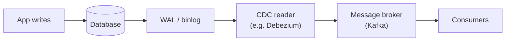

#review #brewing #computer_science #microservices

# Log-based Change Data Capture (CDC)

A way to capture every change to a database by **tailing its write-ahead / transaction log** (e.g. Postgres WAL, MySQL binlog) rather than polling tables. Referenced from [[OutboxPattern]] as the low-overhead alternative to polling.

## Why the log, not polling
The database already writes an ordered, durable log of every insert/update/delete for its own recovery. CDC just *reads* that log:
- **Low overhead** — no repeated `SELECT ... WHERE updated_at > ?` queries competing with real traffic.
- **Near-real-time** — changes are emitted as they're committed.
- **Complete & ordered** — you see every change in commit order, including deletes (which polling can miss).

## Where it fits
- Streams DB changes into a message broker (e.g. via Debezium → Kafka), decoupling producers from consumers.
- A common engine behind the [[OutboxPattern]]: instead of a poller reading the outbox table, CDC tails the log and publishes outbox rows as events — avoiding dual writes.

## Trade-offs
- Tightly coupled to the database's log format / version.
- Needs care around schema changes and log retention.

---
Part of [[Computers]] · related: [[OutboxPattern]].
