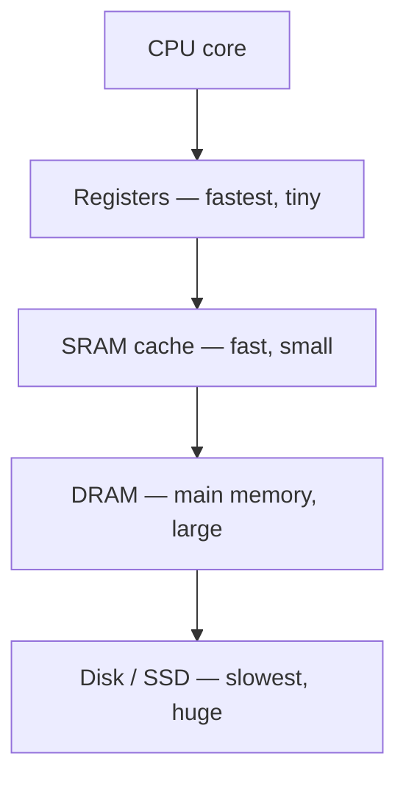

#review #brewing #digital #fundamentals #computer_science

# Memory (RAM)

Storing many bits and getting any one back by its **address**. Built by taking the 1-bit cells from [[Sequential Logic]] (or [[Capacitor|capacitors]]) and tiling them into a huge grid, with a **decoder** ([[Combinational Logic]]) to select a row.

## Two main flavours
- **SRAM** (static) — each bit is a little flip-flop (~6 [[MOSFET|transistors]]). Fast, holds its value as long as it's powered, but bulky/expensive. Used for [[Caching|CPU caches]] and registers.
- **DRAM** (dynamic) — each bit is *one [[Capacitor]] + one transistor*. Tiny and cheap, so you get gigabytes — but the capacitor leaks, so it must be **refreshed** (rewritten) thousands of times a second. This is your main system RAM.

## Why the split matters
It's the origin of the **memory hierarchy**: a small amount of fast SRAM close to the [[CPU]], backed by lots of slower DRAM. As noted in [[CPU]], processor speed outran memory speed, so hiding memory latency (via [[Caching]]) became central to performance.

Memory is where the results computed by [[Combinational Logic]] and held by [[Sequential Logic]] live between steps of the [[Instruction Cycle]].

---
Part of [[Electrons to CPU]].
