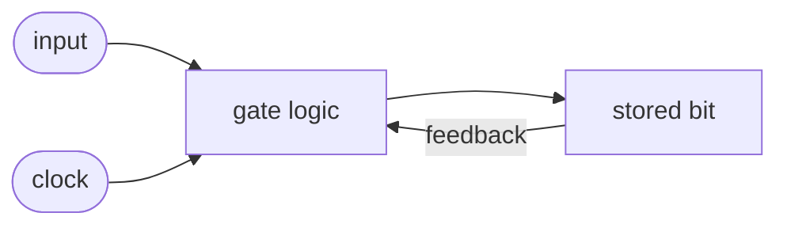

#review #brewing #digital #fundamentals #computer_science

# Sequential Logic

Circuits whose output depends on **current inputs *and* stored past state**. This is where a machine gains **memory** — the thing [[Combinational Logic]] can't do.

## The trick: feedback
Loop a gate's output back to its own input and the circuit can *hold* a value even after the input goes away. That's a **latch** — the simplest 1-bit memory (a cross-coupled pair of NAND/NOR [[Logic Gates|gates]]).

## Latch → Flip-Flop
A plain latch changes whenever its inputs change — hard to keep orderly across millions of them. A **flip-flop** is a latch that only updates on the *edge* of a [[Clock Signal]] (the instant it ticks). So every flip-flop in the chip captures its new value at the same moment → the whole machine advances in lockstep.

- **1 flip-flop** = 1 bit of state.
- **n flip-flops** side by side = an n-bit **register** (holds one number).
- Many registers = the CPU's working scratchpad and the basis of [[Memory]].

## Why it completes the picture
[[Combinational Logic]] computes the *next* value; sequential logic *stores* it at each clock tick. Compute → store → compute again. That repeating rhythm, paced by the [[Clock Signal]], is exactly what a [[CPU]] does when it steps through instructions ([[Instruction Cycle]]).

---
Part of [[Electrons to CPU]].
