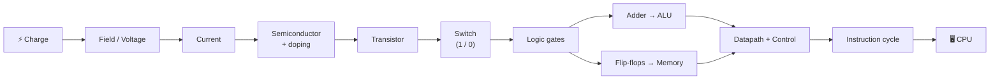

#brewing #electronics #digital #fundamentals #computer_science

# 🗺️ Electrons to CPU — MOC

The full chain from *charge* to a *running program*. Each link below is a small atomic note; read top-to-bottom and every layer is built from the one above it. The recurring theme: **each level hides the messy physics below it behind a clean abstraction.**

## The one-line story
Charge feels a field → a field is a voltage → voltage pushes current → we control that current in silicon → a controlled switch is a transistor → switches make logic gates → gates make arithmetic and memory → arithmetic + memory + control = a CPU running instructions.

## 1 · Physics — charge and materials
- [[Electric Charge and Field]] — what makes charges move (the "why" behind current)
- [[Circuit Physics]] — Ohm's law, voltage, current, conductors/insulators/semiconductors *(hub note)*
- [[Semiconductor]] — why silicon sits between conductor and insulator, and why that's controllable
- [[Doping]] — N-type and P-type: manufacturing free electrons and holes

## 2 · Components — the passive & active parts
- [[Resistor]] — limit current, set voltages
- [[Capacitor]] — store charge; timing and DRAM bits
- [[Diode]] — the PN junction: a one-way valve
- [[Transistor]] — **the pivotal invention**: a small signal controls a large current
- [[MOSFET]] — the voltage-controlled switch modern chips are made of

## 3 · The bridge — physics becomes digital
- [[Transistor as a Switch]] — using only ON/OFF extremes (the key mental jump)
- [[Binary and Bits]] — why 1s and 0s, and how they encode everything
- [[Logic Gates]] — building NOT/NAND/NOR from MOSFETs (CMOS)
- [[Boolean Algebra]] — the math that lets us *design* logic

## 4 · Combinational logic — computing
- [[Combinational Logic]] — output = function of inputs (no memory)
- [[Adder]] — how gates do arithmetic

## 5 · Sequential logic — remembering & timing
- [[Sequential Logic]] — feedback → latches → flip-flops → registers (state!)
- [[Clock Signal]] — the heartbeat that keeps everything in step
- [[Memory]] — SRAM & DRAM: tiling bit-cells into addressable storage

## 6 · Assembling a CPU
- [[ALU]] — the calculator (built on the [[Adder]])
- [[Datapath and Control Unit]] — the roads and the traffic lights
- [[Instruction Cycle]] — fetch → decode → execute, the loop that runs a program
- [[CPU]] — cycles, threads, and why memory access dominates cost

## Where it goes next
Above the [[Instruction Cycle]] sits machine code, then programming languages, then everything else in [[Computers]] (systems, algorithms, tooling). Below [[Electric Charge and Field]] sits quantum mechanics (out of scope here).

## Open threads
- [ ] Add a diagram: transistor → NOT gate → adder → ALU (visual chain)
- [ ] Pipelining & superscalar execution (why real CPUs overlap the [[Instruction Cycle]])
- [ ] How the memory hierarchy ([[Caching]]) hides DRAM latency

---
A **thread** across [[Physics]] → [[Electronics]] → [[Computers]]. Parent: [[Home]].
